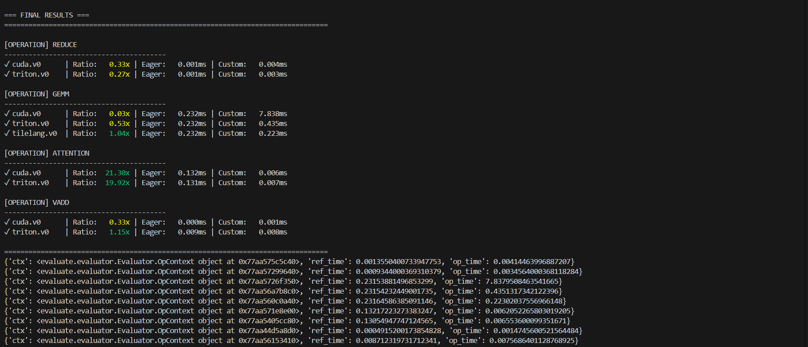

# oplib
## op list
- Gemm
- Reduce
- Multi-Head Attention
- Vector add
- TODO

## backend 
- [x] torch
- [x] cuda
- [ ] triton
- [ ] cutile
- [ ] tilelang

# Quick start
install ops
```
python setup.py install
```
run ops
```
python run.py
```
results:
