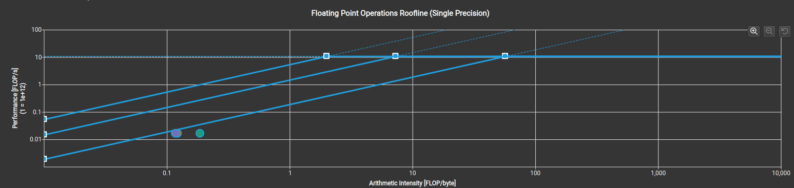

# 常见API
### 生成 *.ncu-rep 文件
```
# run python
ncu --set full -o xxx [python ./xxx.py]

# run cuda
ncu --set full -o xxx [./exe]
```

### 使用 ncu-ui profile
```
ncu-ui xxx.ncu-rep
```

# Metric 学习
### Roofline Model
Compute-bound $\pi$ 决定"屋顶"的高度；

Memory-bound $\beta$ 决定"房檐"的斜率；

最大计算强度 $I_{max} = \frac{\pi}{\beta}$ 是屋顶和屋檐的交界点


上图存在三条屋檐线，从右到左分别代表：
1. dram roofline
2. L2 roofline
3. L1 roofline
可以看到算子 add_kernel 的算术强度AI 太低了，导致算子处于绝对的 memory-bound
注意：roofline model 是个简化的模型，没有考虑 cache 层级
启发：对于给定的 workload，在计算强度固定的情况下，需要努力提升带宽利用率。