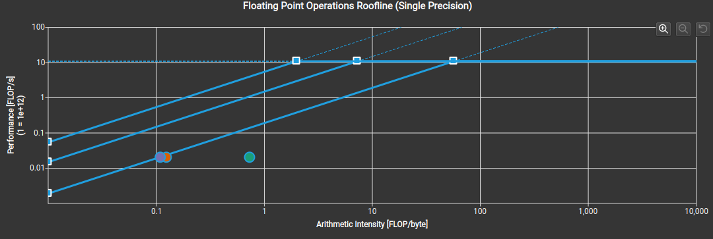

# 定义
vector_add 用于计算 C = A + B 运算

# 数据规模
```python
self.N = 102400
self.X: torch.Tensor
self.Y: torch.Tensor
self.incx = 1
self.incy = 1
```
# CUDA V0 实现逻辑
```c++
__global__ void vector_add_kernel(float *c, const float *a, const float *b, int n)
{
    int idx = blockIdx.x * blockDim.x + threadIdx.x;
    if (idx < n) {
        c[idx] = a[idx] + b[idx];
    }
}

void launch_vector_add_kernel(torch::Tensor &c, const torch::Tensor &a, const torch::Tensor &b)
{
    int n = a.numel();
    const int blocksize = 1024;
    const int gridsize = (n + blocksize -1) / blocksize;

    vector_add_kernel<<<gridsize, blocksize>>> (
        c.data_ptr<float>(),
        a.data_ptr<float>(),
        b.data_ptr<float>(),
        n
    );
}
```
V0 版本是最原始的版本，耗时 6.43 us


V0 代码对应的 Compute & Memory 如下:

对应 roofline 模型 如下，可以看到计算强度 AI 太低了。


# CUDA V1 实现逻辑
```c++
// use smem and register
__global__ void vector_add_v1_kernel(float *c, const float *a, const float *b, int n)
{
    __shared__ float smem_a[1024 * 4];
    __shared__ float smem_b[1024 * 4];
    int idx = blockIdx.x * blockDim.x + threadIdx.x;
    int tid = threadIdx.x;

    float c_tile[4] = {0.0f};

    // gmem -> smem
    if(idx + 3 < n) {
        smem_a[tid * 4 + 0] = a[idx * 4 + 0];
        smem_a[tid * 4 + 1] = a[idx * 4 + 1];
        smem_a[tid * 4 + 2] = a[idx * 4 + 2];
        smem_a[tid * 4 + 3] = a[idx * 4 + 3];
        smem_b[tid * 4 + 0] = b[idx * 4 + 0];
        smem_b[tid * 4 + 1] = b[idx * 4 + 1];
        smem_b[tid * 4 + 2] = b[idx * 4 + 2];
        smem_b[tid * 4 + 3] = b[idx * 4 + 3];
    } else {
        smem_a[tid * 4 + 0] = (idx + 0 < n ? a[idx * 4 + 0] : 0.0f); 
        smem_a[tid * 4 + 1] = (idx + 1 < n ? a[idx * 4 + 1] : 0.0f); 
        smem_a[tid * 4 + 2] = (idx + 2 < n ? a[idx * 4 + 2] : 0.0f); 
        smem_a[tid * 4 + 3] = (idx + 3 < n ? a[idx * 4 + 3] : 0.0f); 

        smem_b[tid * 4 + 0] = (idx + 0 < n ? b[idx * 4 + 0] : 0.0f); 
        smem_b[tid * 4 + 1] = (idx + 1 < n ? b[idx * 4 + 1] : 0.0f); 
        smem_b[tid * 4 + 2] = (idx + 2 < n ? b[idx * 4 + 2] : 0.0f); 
        smem_b[tid * 4 + 3] = (idx + 3 < n ? b[idx * 4 + 3] : 0.0f); 
    }

    __syncthreads();

    if (idx + 3 < n) {
        c_tile[tid * 4 + 0] = smem_a[tid * 4 + 0] + smem_b[tid * 4 + 0];
        c_tile[tid * 4 + 1] = smem_a[tid * 4 + 1] + smem_b[tid * 4 + 1];
        c_tile[tid * 4 + 2] = smem_a[tid * 4 + 2] + smem_b[tid * 4 + 2];
        c_tile[tid * 4 + 3] = smem_a[tid * 4 + 3] + smem_b[tid * 4 + 3];
    } else {
        c_tile[tid * 4 + 0] = (idx + 0 < n ? smem_a[tid * 4 + 0] + smem_b[tid * 4 + 0] : 0.0f);
        c_tile[tid * 4 + 1] = (idx + 1 < n ? smem_a[tid * 4 + 1] + smem_b[tid * 4 + 1] : 0.0f);
        c_tile[tid * 4 + 2] = (idx + 2 < n ? smem_a[tid * 4 + 2] + smem_b[tid * 4 + 2] : 0.0f);
        c_tile[tid * 4 + 3] = (idx + 3 < n ? smem_a[tid * 4 + 3] + smem_b[tid * 4 + 3] : 0.0f);
    }
    __syncthreads();

    // smem -> gmem
    c[idx * 4 + 0] = c_tile[tid * 4 + 0];
    c[idx * 4 + 1] = c_tile[tid * 4 + 1];
    c[idx * 4 + 2] = c_tile[tid * 4 + 2];
    c[idx * 4 + 3] = c_tile[tid * 4 + 3];
    __syncthreads();
}

vector_add_v1_kernel<<<gridsize, blocksize>>> (
    c.data_ptr<float>(),
    a.data_ptr<float>(),
    b.data_ptr<float>(),
    n
);
```
V1 实现了 smem 访存 + 向量化访存,平均耗时约为 20us


对应的 roofline model 如下:
可以看到 dram 的AI 增加至0.74, 计算速率达到 18G
