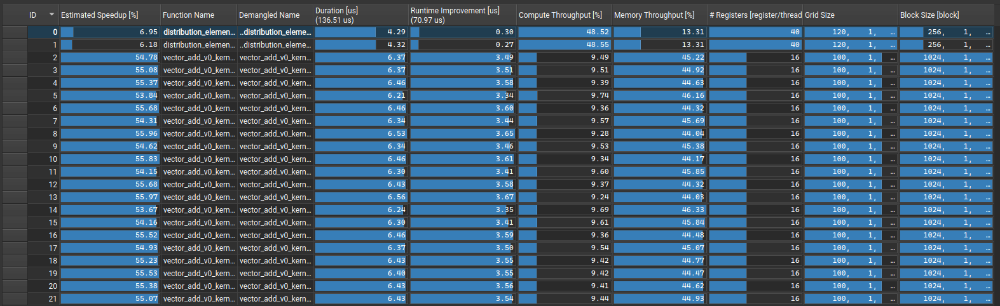
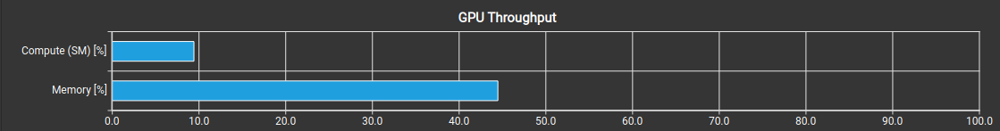
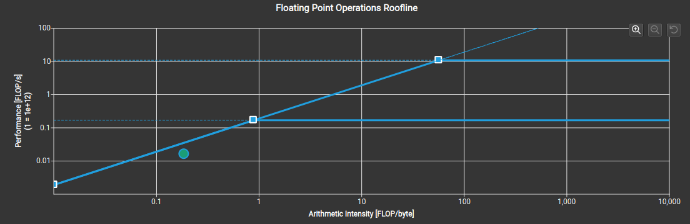
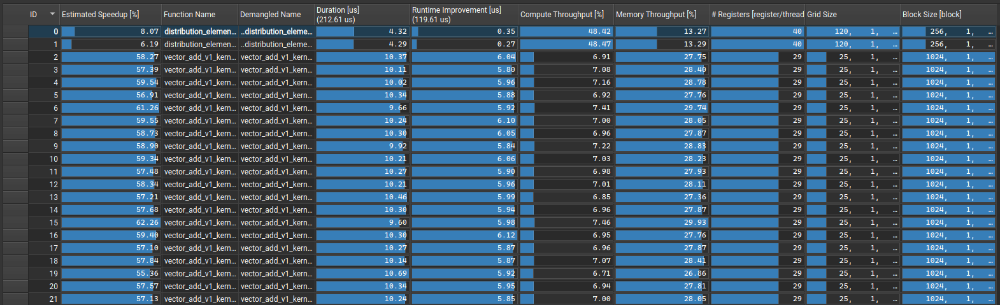
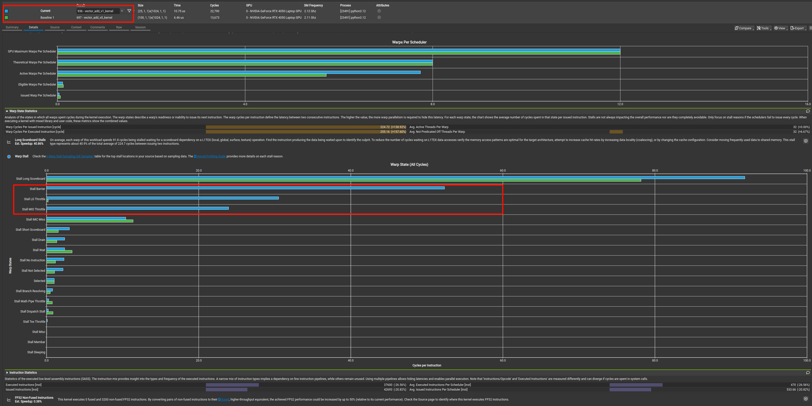
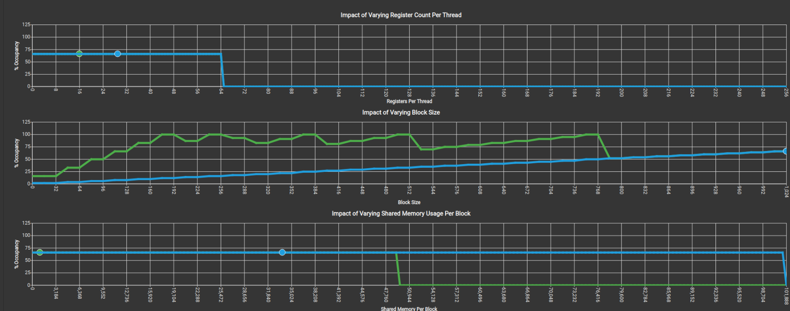

# 定义
vector_add 用于计算 C = A + B 运算

# 数据规模
```python
self.N = 102400
self.X: torch.Tensor
self.Y: torch.Tensor
self.incx = 1
self.incy = 1
```
# CUDA V0 实现逻辑
```c++
__global__ void vector_add_kernel(float *c, const float *a, const float *b, int n)
{
    int idx = blockIdx.x * blockDim.x + threadIdx.x;
    if (idx < n) {
        c[idx] = a[idx] + b[idx];
    }
}

void launch_vector_add_kernel(torch::Tensor &c, const torch::Tensor &a, const torch::Tensor &b)
{
    int n = a.numel();
    const int blocksize = 1024;
    const int gridsize = (n + blocksize -1) / blocksize;

    vector_add_kernel<<<gridsize, blocksize>>> (
        c.data_ptr<float>(),
        a.data_ptr<float>(),
        b.data_ptr<float>(),
        n
    );
}
```
V0 版本是最原始的版本，耗时 6.43 us


V0 代码对应的 Compute & Memory 如下:

对应 roofline 模型 如下，可以看到计算强度 AI 太低了。



# CUDA V1 实现逻辑
```c++
// use smem and register
__global__ void vector_add_v1_kernel(float *c, const float *a, const float *b, int n)
{
    __shared__ float smem_a[1024 * 4];
    __shared__ float smem_b[1024 * 4];
    int idx = blockIdx.x * blockDim.x + threadIdx.x;
    int tid = threadIdx.x;

    float c_tile[4] = {0.0f};

    // gmem -> smem
    if(idx + 3 < n) {
        smem_a[tid * 4 + 0] = a[idx * 4 + 0];
        smem_a[tid * 4 + 1] = a[idx * 4 + 1];
        smem_a[tid * 4 + 2] = a[idx * 4 + 2];
        smem_a[tid * 4 + 3] = a[idx * 4 + 3];
        smem_b[tid * 4 + 0] = b[idx * 4 + 0];
        smem_b[tid * 4 + 1] = b[idx * 4 + 1];
        smem_b[tid * 4 + 2] = b[idx * 4 + 2];
        smem_b[tid * 4 + 3] = b[idx * 4 + 3];
    } else {
        smem_a[tid * 4 + 0] = (idx + 0 < n ? a[idx * 4 + 0] : 0.0f); 
        smem_a[tid * 4 + 1] = (idx + 1 < n ? a[idx * 4 + 1] : 0.0f); 
        smem_a[tid * 4 + 2] = (idx + 2 < n ? a[idx * 4 + 2] : 0.0f); 
        smem_a[tid * 4 + 3] = (idx + 3 < n ? a[idx * 4 + 3] : 0.0f); 

        smem_b[tid * 4 + 0] = (idx + 0 < n ? b[idx * 4 + 0] : 0.0f); 
        smem_b[tid * 4 + 1] = (idx + 1 < n ? b[idx * 4 + 1] : 0.0f); 
        smem_b[tid * 4 + 2] = (idx + 2 < n ? b[idx * 4 + 2] : 0.0f); 
        smem_b[tid * 4 + 3] = (idx + 3 < n ? b[idx * 4 + 3] : 0.0f); 
    }

    __syncthreads();

    if (idx + 3 < n) {
        c_tile[tid * 4 + 0] = smem_a[tid * 4 + 0] + smem_b[tid * 4 + 0];
        c_tile[tid * 4 + 1] = smem_a[tid * 4 + 1] + smem_b[tid * 4 + 1];
        c_tile[tid * 4 + 2] = smem_a[tid * 4 + 2] + smem_b[tid * 4 + 2];
        c_tile[tid * 4 + 3] = smem_a[tid * 4 + 3] + smem_b[tid * 4 + 3];
    } else {
        c_tile[tid * 4 + 0] = (idx + 0 < n ? smem_a[tid * 4 + 0] + smem_b[tid * 4 + 0] : 0.0f);
        c_tile[tid * 4 + 1] = (idx + 1 < n ? smem_a[tid * 4 + 1] + smem_b[tid * 4 + 1] : 0.0f);
        c_tile[tid * 4 + 2] = (idx + 2 < n ? smem_a[tid * 4 + 2] + smem_b[tid * 4 + 2] : 0.0f);
        c_tile[tid * 4 + 3] = (idx + 3 < n ? smem_a[tid * 4 + 3] + smem_b[tid * 4 + 3] : 0.0f);
    }
    __syncthreads();

    // smem -> gmem
    c[idx * 4 + 0] = c_tile[tid * 4 + 0];
    c[idx * 4 + 1] = c_tile[tid * 4 + 1];
    c[idx * 4 + 2] = c_tile[tid * 4 + 2];
    c[idx * 4 + 3] = c_tile[tid * 4 + 3];
    __syncthreads();
}
int n = a.numel();

const int blocksize = 1024;
const int gridsize = (n + blocksize -1) / blocksize / 4;

vector_add_v1_kernel<<<gridsize, blocksize>>> (
    c.data_ptr<float>(),
    a.data_ptr<float>(),
    b.data_ptr<float>(),
    n
);
```
V1 实现了 smem 访存 + 向量化访存,平均耗时约为 10us

优化访存后耗时却增加了，Warp State Statistics 显示：新增了 `Stall Barrier`, `Stall LG Throttle`, `Stall MIO Throttle` 耗时

有关 warp 的前置知识是这样的：
```
结构划分：SM 分为 4个 SMSP(SM sub partition) 和 1个 warp pool, warp pool 用于存储待调度的 warp，这些 warp 数量上限由用户调度 kernel 时的配置决定。

每个 SMSP 都有一个 warp scheduler, 各个 warp scheduler 从 warp pool 中选取 warp 加入到独立维护的 warp 队列，warp 队列的容量被称为 warp slots

SM_0
   |———— warp pool
   |———— SMSP_0
            |———— scheduler
                       |———— queue

   |———— SMSP_1
   |———— SMSP_2
   |———— SMSP_3
SM_1
SM_2
......
```
本人的显卡 RTX 4050 参数如下：
```
SM Count:   20
SMSP / SM:  4
warp slot:  12
```
可知：RTX 4050 一个 cycle 可以 launch $20 * 4 == 80$ 个 warp中的指令，可追踪 $20 * 4 * 12 == 960$ 个 warp


```
vadd V0 划分的 warp 数量:  $102400 / 1024 * (1024 / 32) = 3200$
vadd V1 划分的 warp 数量:  $102400 / 4096 * (1024 / 32) = 800$
```
当任务划分的 warp 数量小于可追踪的数量时，硬件资源未完全利用。

V0 代码划分出 3200 个warp，远超可追踪的warp数量；
V1 代码划分出 800  个warp，小于可追踪的warp数量；

可追踪的 warp 数量是理论上限，实际运行的 warp 数量可能远低于这个上限，我们可以用 occupancy 指标衡量活跃的 warp 数占比。

## Occupancy 
occupancy = $\frac{活跃的 Warp 数量}{SM 支持的 Warp Slot 上限}$

occupancy 受这些因素影响：
1. Varing Register Count per Thread
2. Varing block size
3. Varing Shared Memory Usage Per Block

我们不妨通过这个角度理解 occupancy:
```
SM 内硬件资源是固定的（Register & Shared Memory）
SM 可以容纳多个 Block
Block 在执行过程中所需硬件资源是固定的

这是一个装箱问题，能容纳多少 block 取决于 SM 剩余硬件资源能否容纳下一个 Block 的需求 (Register, Shared Memory)。 
```
上面角度解释了影响因素 1 和 3，关于影响因素 2 我的理解是这样的：
```
假设 block1 内有 (32)  个线程，需要处理的元素个数为 n，每个线程处理1个元素，则总warp数为  n / 32
假设 block2 内有 (1024)个线程，需要处理的元素个数为 n, 每个线程处理1个元素，则总warp数为  n / 1024 * (1024 / 32) = n / 32
```
看起来两种情况 warp 数是一样的，但考虑到SM内资源是有限的，block 内线程越多调度越困难: 
如果 block2 使用了 SM 内 60% 的资源，则 SM 放不下第二个 block；

block 内线程也不是越少越好，SM 内能容纳的 block 是有限的，过多的 block 会增加调度的开销。
总而言之各个参数需要达到平衡。

下图显示 v0 和 v1 在 occupancy 均正常


