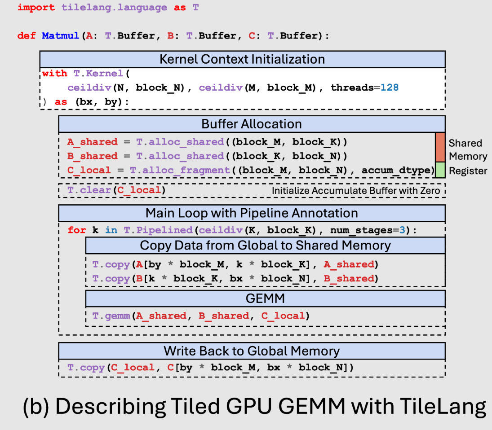

# Tilelang 基础API
Tilelang 典型程序如下所示:


## T.alloc_shared
分配 shared memory
```python
T.alloc_shared((M, N), dtype= )
```

## T.alloc_fragment
分配 register 
```python
T.alloc_fragment((size), accum_dtype=)
```

## T.copy
global memory 和 hardware-specific memory 间的数据传输
```python
# gmem -> smem
T.copy(A[], A_smem)
# smem -> gmem
T.copy(A_smem, A[])
```

## T.clear & T.fill
清空 hardware-specific memory
```python
A_smem = T.alloc_shared(size, dtype)
B_smem = T.alloc_shared(size, dtype)
C_tile = T.alloc_fragment(size, dtype)

T.clear(A_smem)
T.fill(C_tile)
```

# Tilelang 控制流
Tilelang 控制流包含这些内容:
- 条件语句 if / elif/ else 
- 循环语句

## Tilelang 循环语句
### Serial
```python
# 0 .. N-1
for i in T.serial(N):
    ...

# 0, 2, 4
for i in T.serial(0, N, 2):
    ...
```
### Unroll
静态展开为重复指令
for k in T.unroll(K_TILE):
    acc += a[k] * b[k]

### Parallel
element-wise level 的并行优化
```python
for i, j in T.parallel(M, N):
    C[i, j] = A[i, j] + B[i, j]
```

### Pipeline
计算 / 访存 level 的流水线隐藏
```python
for ko in T.Pipelined(T.ceildiv(K, BK), num_stages=3):
    T.copy(A[by * BM, ko * BK], A_s)  # stage: copy A tile
    T.copy(B[ko * BK, bx * BN], B_s)  # stage: copy B tile
    T.gemm(A_s, B_s, C_f)             # stage: compute
```